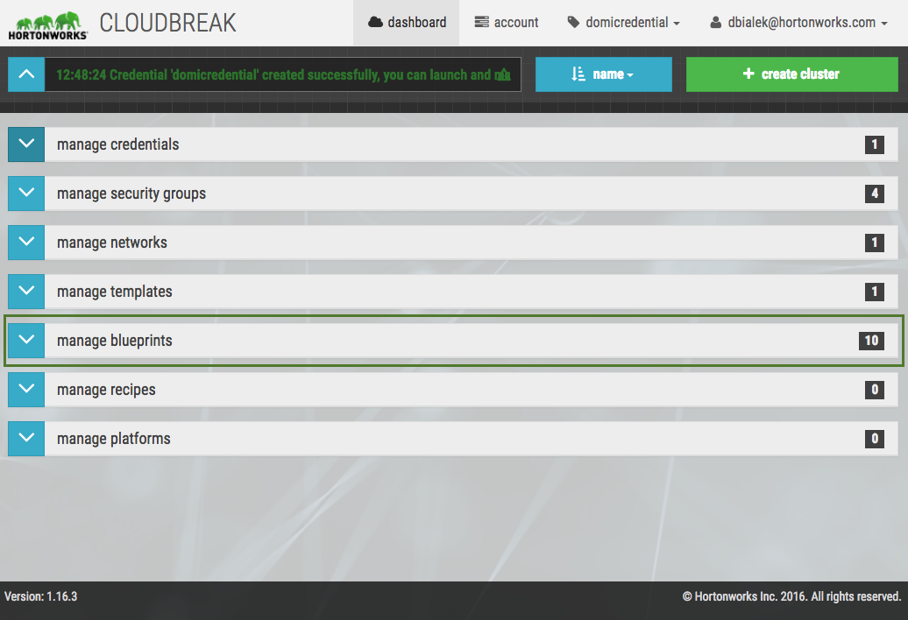

**Cluster blueprints** are your declarative definition of a Hadoop cluster, defining the host groups and which components to install on which host group. Ambari uses them as a base for your clusters. 

You have three options:

* Use one of the pre-defined blueprints.  
* Copy and edit one of the pre-defined blueprints.   
* Add your custom blueprint by uploading a JSON file or pasting the JSON text. 

We recommend that you review the default blueprints to check if they meet your requirements. You can do this by expanding  the **manage bluerints** pane in the Cloudbreak web UI (shown in the screenshot) or by reading the documentation below.  

 

[Here](https://raw.githubusercontent.com/sequenceiq/cloudbreak/master/integration-test/src/main/resources/blueprint/multi-node-hdfs-yarn.bp) is an example of a blueprint. 

The host groups in the JSON will be mapped to a set of instances when starting the cluster, and the specified services and components will be installed on the corresponding nodes. It is not necessary to define a complete configuration in the blueprint. If a configuration is missing, Ambari will fill that with a default value. 

A blueprint can be modified later from the Ambari UI.

A blueprint can be exported from a running Ambari cluster and can be reused in Cloudbreak after slight modifications. When a blueprint is exported, some configurations are hardcoded for example domain names, memory configurations, and so on, that won't be applicable to the Cloudbreak cluster. There is no automatic way to modify an exported blueprint and make it instantly usable in Cloudbreak, the modifications have to be done manually.

### Default Blueprints 

Cloudbreak includes three default HDP cluster blueprints:

| Name | Description | Services | Source |
|----|----|---|---|
| hdp-small-default | Launch a multi-node HDP 2.4 cluster. | HDFS, YARN, MAPREDUCE2, KNOX, HBASE, HIVE, HCATALOG, WEBHCAT, SLIDER, OOZIE, PIG, SQOOP, METRICS, TEZ, FALCON, ZOOKEEPER | [hdp-small-default.bp](https://raw.githubusercontent.com/hortonworks/cloudbreak/master/core/src/main/resources/defaults/blueprints/hdp-small-default.bp) |
| hdp-streaming-cluster | Launch a multi-node HDP 2.4 cluster optimized for streaming. | HDFS, YARN, MAPREDUCE2, STORM, KNOX, HBASE, HIVE, HCATALOG, WEBHCAT, SLIDER, OOZIE, PIG, SQOOP, METRICS, TEZ, FALCON, ZOOKEEPER | [hdp-streaming-cluster.bp](https://raw.githubusercontent.com/hortonworks/cloudbreak/master/core/src/main/resources/defaults/blueprints/hdp-streaming-cluster.bp) |
| hdp-spark-cluster | Launch a multi-node HDP 2.4 cluster optimized for Spark analytic jobs. | HDFS, YARN, MAPREDUCE2, SPARK, ZEPPELIN, KNOX, HBASE, HIVE, HCATALOG, WEBHCAT, SLIDER, OOZIE, PIG, SQOOP, METRICS, TEZ, FALCON, ZOOKEEPER | [hdp-spark-cluster.bp](https://raw.githubusercontent.com/hortonworks/cloudbreak/master/core/src/main/resources/defaults/blueprints/hdp-spark-cluster.bp) |

### Copy and Edit Existing Blueprint 

You can modify default or previously added blueprints in the **manage blueprints** tab. To do that, expand the entry in the Cloudbreak UI and then click **copy & edit**. 

### Add Custom Blueprint

You can define reusable blueprints for your clusters in the **manage blueprints** tab. To add your own blueprint, click **+create blueprint** and enter the following parameters:

| Parameter | Value |
|---|---|
| Name | Enter a name for your blueprint. |
| Description | (Optional) Enter a description for your blueprint.|
| Blueprint Source| 
Select one of: <ul><li>**Text**: Paste blueprint in JSON format.</li><li> **File**: Upload a file that contains the blueprint.</li><li> **URL**: Specify the URL for your blueprint.</li></ul> |
| Public In Account | (Optional) If this option is checked, all the users belonging to your account will be able to use this blueprint to create clusters, but they cannot delete it. | 

