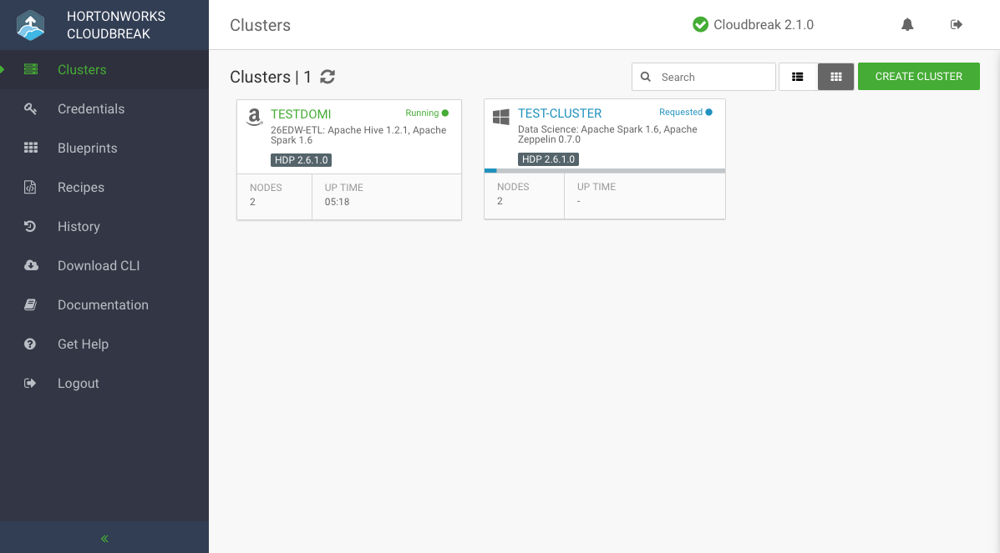

## Manage and Monitor Clusters  

You can manage monitor your clusters from the Cloudbreak UI. To do that, click on the title representing the cluster that you want to access: 

 

### Accessing Links to Cluster Services

You can access links to cluster services from the **Services** tab.

### Managing Cluster Nodes

You can view details about your cluster nodes (for example, Public IP addresses) from the **Nodes** tab. You can also delete nodes using the **TERMINATE** option.

### Accessing Event Log

You can access cluster event log from the **Event History** tab.

### Repairing Your Cluster

To trigger repair process for your cluster, click **repair**. Faulty nodes will be deleted from the cluster and new ones will be added in their place. 

### Terminating Your Cluster 

To terminate your cluster, click **terminate**. All cluster-related resources will be deleted, unless the network is used by other VMs, in which case it will not be deleted. 
