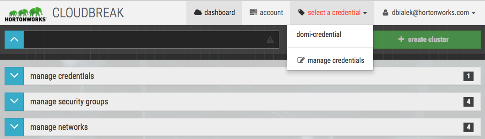

1. Log in to the Cloudbreak UI.
    
2. In the top right corner, select the credential that you want to use to create a cluster:

      

3. Click **+create cluster** and the *Create cluster* form is displayed.

4. On the **Configure Cluster** page, provide the following parameters:

    > To view advanced options, click **Show Advanced Options**. To learn about advanced options, refer to [Advanced Options](#advanced-options).

    | Parameter | Description |
|---|---|
| Cluster Name | Enter a name for your cluster. The name must be between 5 and 40 characters, must start with a letter, must only include lowercase letters, numbers, and hyphens. |
| Tags | (Optional) You can optionally add tags, which will help you find your cluster-related resources, such as VMs, in your cloud provider account. |
| Region | Select the region in which you would like to launch your cluster. |