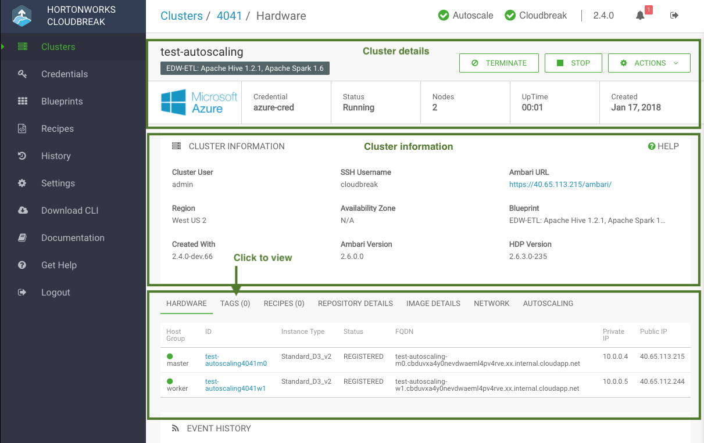

## Accessing Your Cluster

The following section describes how to access the various services in the cluster.

### Finding Cluster Information in the UI

Once your cluster is up and running, click on the tile representing your cluster in the Cloudbreak UI to access information related the cluster and access cluster actions. 

 

The information presented includes:

* [Cluster Summary](#cluster-summary)  
* [Cluster Information](#cluster-information)     
* [Event History](#event-history)  

  
Tips

  
<ul>
  <li> Access cluster actions such as resize and sync by clicking on <b>ACTIONS</b>.</li>
  <li> Access Ambari web UI by clicking on the link in the <b>CLUSTER INFORMATION</b> section.</li>
<li> View public IP addresses for all cluster instances in the <b>HARDWARE</b> section. Click on the links to view the instances in the cloud console.</li>
<li> The SSH user that you must use when accessing cluster VMs is "cloudbreak".</li> 
</ul>

#### Cluster Summary 

The summary bar includes the following information about your cluster:

| Item | Description |
|---|---|
| Cluster Name | The name that you selected for your cluster is displayed at the top of the page. Below it is the name of the cluster blueprint. |
| Time Remaining | If you enabled lifetime management for your cluster, the clock next to the cluster name indicates the amount of time that your cluster will run before it gets terminated. Note that the time remaining counter does not stop when you stop the cluster. |
| Cloud Provider | The logo of the cloud provider on which the cluster is running. |
| Credential | The name of the credential used to create the cluster. |
| Status | Current status. When a cluster is healthy, the status is *Running*. |
| Nodes | The current number of cluster nodes, including the master node. |
| Uptime | The amount of time (HH:MM) that the cluster has been in the running state since it was started. Each time you stop and restart the cluster, the running time is reset to 0. |
| Created | The date when the cluster was created. The date format is Mon DD, YYYY. For example: Oct 27, 2017. |

#### Cluster Information 

The following information is available on the cluster details page: 

| Item | Description |
|---|---|
| Cluster User | The name of the cluster user that you created when creating the cluster. |  
| SSH Username | The SSH user which you must use when accessing cluster VMs via SSH. The SSH user is always "cloudbreak". |
| Ambari URL | Link to the Ambari web UI. |
| Region | The region in which the cluster is running in the cloud provider infrastructure. |
| Availability Zone | The availability zone within the region in which the cluster is running. |
| Blueprint | The name of the blueprint selected under "Cluster Type" to create this cluster. |
| Created With | The version of Cloudbreak used to create this cluster. |
| Ambari Version | The Ambari version which this cluster is currently running. |
| HDP/HDF Version | The HDP or HDF version which this cluster is currently running. |
| Authentication Source | If you are using an external authentication source (LDAP/AD) for your cluster, you can see it here. Refer to [Register an Authentication Source](external-ldap.md). |

Below this, you will see additional tabs that you can click on in order to see their content:

| Item | Description |
|---|---|
|Hardware | This section includes information about your cluster instances: instance names, instance IDs, instance types, their status, fully qualified domain names (FQDNs), and private and public IPs. |
| Tags | This section lists keys and values of the user-defined tags, in the same order as you added them. |
| Recipes | This section includes recipe-related information. For each recipe, you can see the host group on which a recipe was executed, recipe name, and recipe type. Refer to [Recipes](recipes.md). |
| External Databases | If you are using an external database for your cluster, you can see it here. Refer to [Register an External Database](external-db.md). |
| Repository Details | This section includes Ambari and HDP/HDF repository information, as you provided it in the "Base Images" section when creating a cluster. |
| Image Details | This section includes information about the base image that was used for the Cloudbreak instance. |
| Network | This section includes information about the names of the network and subnet in which the cluster is running and the links to related cloud provider console. |
| Security | This section is only available if you have enabled Kerberos security. It provides you with the details of your Kerberos configuration.  
| Autoscaling | This section includes configuration options related to autoscaling. Refer to [Autoscaling](autoscaling.md). |

#### Event History 

The Event History section shows you events logged for the cluster, with the most recent event at the top. For example, after your cluster has been created, the following messages will be written to the log:

<pre>
Ambari cluster built; Ambari ip:34.215.103.66
10/26/2017, 9:41:58 AM
Building Ambari cluster; Ambari ip:34.215.103.66
10/26/2017, 9:30:20 AM
Starting Ambari cluster services
10/26/2017, 9:27:12 AM
Setting up infrastructure metadata
10/26/2017, 9:27:11 AM
Bootstrapping infrastructure cluster
10/26/2017, 9:26:38 AM
Infrastructure successfully provisioned
10/26/2017, 9:26:37 AM
Billing started, Infrastructure successfully provisioned
10/26/2017, 9:26:37 AM
Infrastructure metadata collection finished
10/26/2017, 9:25:39 AM
Infrastructure creation took 194 seconds
10/26/2017, 9:25:37 AM
Creating infrastructure
10/26/2017, 9:22:22 AM
Setting up HDP image
10/26/2017, 9:22:21 AM</pre>

### Accessing Cluster via SSH

If you plan to access the cluster via the command line clients, SSH into the master node instance in the cluster. 

* In order to use SSH, you must generate an SSH key pair or use an existing SSH key pair.  
* You can find the cluster instance public IP addresses on the cluster details page.  
* When accessing instances via SSH use the `cloudbreak` user. 

On Mac OS, you can use the following syntax to SSH to the VM:
<pre>ssh -i "privatekey.pem" cloudbreak@publicIP</pre>
For example:
<pre>ssh -i "dominika-kp.pem" cloudbreak@p52.25.169.132</pre>

On Windows, you can SSH using an SSH client such as PuTTY.

### Access Ambari

You can access Ambari web UI by clicking on the links provided in the **Cluster Information** > **Ambari URL**.

**Steps**

1. From the cluster dashboard, click on the tile representing your cluster to navigate to cluster details.

2. Find the Ambari URL in the **Cluster Information** section. This URL is available once the Ambari cluster creation process has completed.  

3. Click on the **Ambari URL** link.

4. The first time you access the server, your browser will attempt to confirm that the SSL Certificate is valid. Since Cloudbreak automatically generates a self-signed certificate, your browser will warn you about an Untrusted Connection and ask you to confirm a Security Exception. Depending on your browser, perform the steps below to proceed.

    | Browser	| Steps |
|---|---|
| Firefox | Click **Advanced** > Click **Add Exception...** > Click **Confirm Security Exception** |
| Safari	| Click **Continue** |
| Chrome |	Click **Advanced** > Click **Proceed...** |

### Cloudbreak User Accounts

The following table describes what credentials to use to access Cloudbreak and Cloudbreak-managed clusters:

| Component | Method | Description |
|---|---|---|
| Cloudbreak | Web UI, CLI | Access with the username and password provided when launching Cloudbreak on the cloud provider. |
| Cloudbreak | SSH to VM | Access as the "cloudbreak" user with the SSH key provided when launching Cloudbreak on the cloud provider. |
| Cluster | SSH to VMs | Access as the "cloudbreak" user with the SSH key provided during cluster creation. |
| Cluster | Ambari UI |Access with the credentials provided in the “Cluster User” parameter during cluster creation. |

