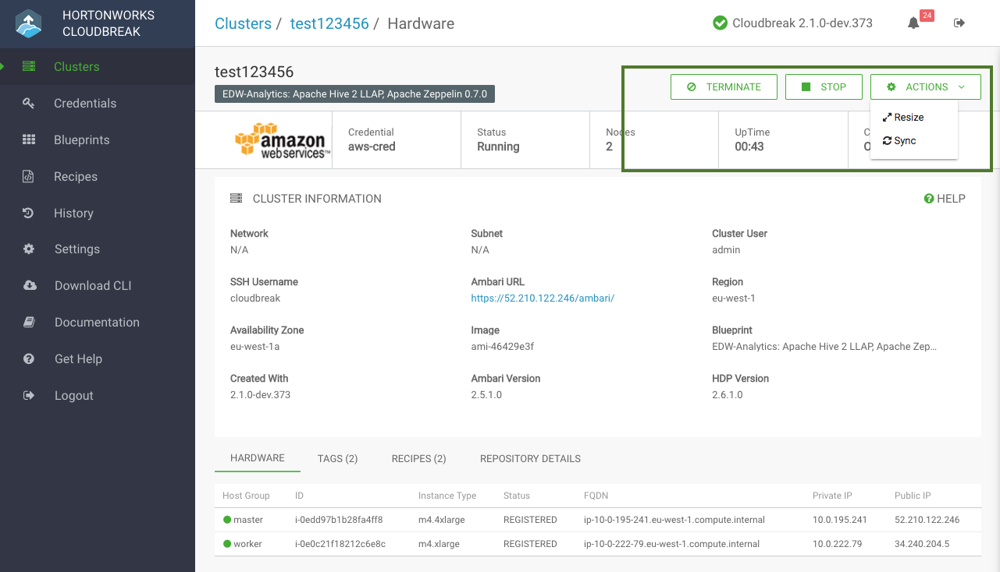
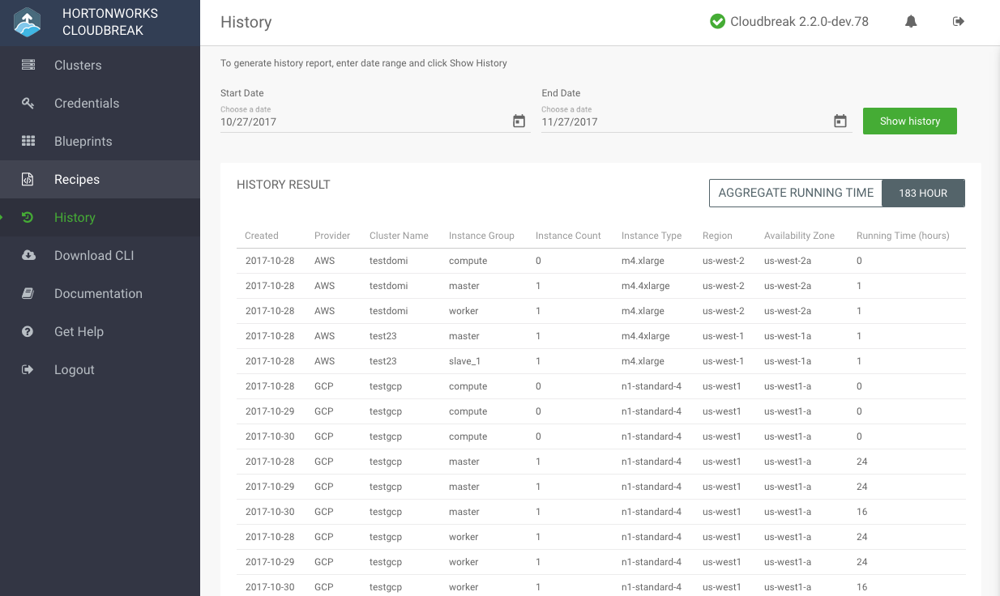

## Managing and Monitoring Clusters  

You can manage monitor your clusters from the Cloudbreak UI. To do that, click on the tile representing the cluster that you want to access. The actions available for your cluster are listed in the top right corner: 

 

  
Tips

  
<ul>
  <li>To add or remove nodes from your cluster click <b>ACTIONS>Resize</b>.</li>
  <li>To synchronize your cluster with the cloud provider account click <b>ACTIONS>Sync</b>.</li>
  <li>To temporarily stop your cluster click <b>STOP</b>.</li>
  <li>To terminate your cluster click <b>TERMINATE</b>.</li>
</ul>

### Resize Cluster

To resize a cluster, follow these steps.

**Steps**

1. Browse to the cluster details.

2. Click **Actions** and select **Resize**. The cluster resize dialog is displayed.

3. Using the +/- controls, adjust the number of nodes for a chosen host group. 

    > You can only modify one host group at a time.   
    > It is not possible to resize the Ambari server host group.     

4. Click **Yes** to confirm the scale-up/scale-down.

    While nodes are being added or removed, cluster status changes to "Update In Progress". Once the operation has completed, cluster status changes back to "Running". 

### Synchronize the Cluster 

Use the **sync** option if you:  

* Made changes on your cloud provider side (for example, deleted cluster VMs) and you would like to synchronize Cloudbreak with the cloud provider.  
* Manually changed service status in Ambari (for example, restarted services).   

[comment]: <> (What are some examples where this option should be used?)

To synchronize your cluster with the cloud provider, follow these steps. 

**Steps**

1. Browse to the cluster details.

2. Click **Actions** and select **Sync**.
 
3. Click **Yes** to confirm.

    Your cluster infrastructure is synchronized based on changes on the cloud provider. The updates are written to the "Event History". 
 
 
### Stop Cluster 

Cloudbreak supports stopping and restarting clusters. To stop and restart a cluster managed by Cloudbreak, use the options available from the Coudbreak UI. 

**Steps**

1. Browse to the cluster details.
 
2. Click **Stop** to stop a currently running cluster.  

3. Click **Yes** to confirm. 

4. Your cluster status changes to "Stopping in progress" and then to "Stopped". Once stopping the infrastructure has completed, you will see a **Start** option to restart your cluster. 

When a cluster is in the "stopped" state, you are not charged for the VMs, but you are charged for external storage.  

### Restart Cluster 

If your cluster is in the "Stopped" state, you can restart the cluster by follow these steps.

**Steps**

1. click **Start**. This option is only available when the cluster has been stopped. 

2. Click **Yes** to confirm.

    Your cluster status changes to "Start in progress" and then to "Running". 

### Terminate Cluster 

To terminate a cluster managed by Cloudbreak, use the option available from the Coudbreak UI. 

**Steps**

1. Browse to the cluster details.
 
2. Click **Terminate**. 

3. Click **Yes** to confirm.

    All cluster-related resources will be deleted, unless the resources (such as networks and subnets) existed prior to cluster creation or are used by other VMs in which case they will be preserved. 

#### Force Terminate

Cluster deletion may fail if Cloudbreak is unable to delete one or more of the cloud resources that were part of your cluster infrastructure. In such as case, you can use the **Terminate** > **Force terminate** option to remove the cluster entry from the Cloudbreak web UI, but you must also check your cloud provider account to see if there are any resources that must be deleted manually.

**Steps**

1. Browse to the cluster details.
 
2. Click **Terminate**. 

3. Check  **Force terminate**.

3. Click **Yes** to confirm. 

    When terminating a cluster with Kerberos enabled, you have an option to disable Kerberos prior to cluster termination. This option removes any cluster-related principals from the KDC.

4. This deletes the cluster tile from the UI.  

4. Log in to your cloud provider account and [manually delete](cb-delete.md) any resources that failed to be deleted.

### View Cluster History

From the navigation menu in the Cloudbreak UI, you can access the History page that allows you to generate a report showing basic information related to the clusters that were running within the specified range of dates.

To generate a report, follow these steps.

**Steps**

1. From the Cloudbreak UI navigation menu, select **History**.

2. On the History page, select the range of dates and click **Show History** to generate a report for the selected period.

     

#### History Report Content 

Each entry in the report represents one cluster instance group. For each entry, the report includes the following information:

* **Created** - The date when your cluster was created (YYYY-MM-DD).
* **Provider** - The name of the cloud provider (AWS, Azure, Google, or OpenStack) on which the cluster instances are/were running.
* **Cluster Name** - The name that you selected for the cluster.  
* **Instance Group** - The name of the host group.   
* **Instance Count** - The number of nodes in the host group. This number may be a decimal if a cluster has been resized.
* **Instance Type** - Provider-specific VM type of the cluster instances. 
* **Region** - The AWS region in which your cluster is/was running.
* **Availability Zone** - The availability zone in which your cluster is/was running.      
* **Running Time (hours)** - The sum of the running times for all the nodes in the instance group.

The **AGGREGATE RUNNING TIME** is the sum of the Running Times, adjusted for the selected time range.

To learn about how your cloud provider bills you for the VMs, refer to their documentation:

* [AWS](https://aws.amazon.com/premiumsupport/knowledge-center/ec2-instance-hour-billing/)      
* [Azure](https://azure.microsoft.com/en-us/pricing/faq/virtual-machines-how-do-instance-sizes-get-billed/)     
* [GCP](https://cloud.google.com/compute/pricing)   

