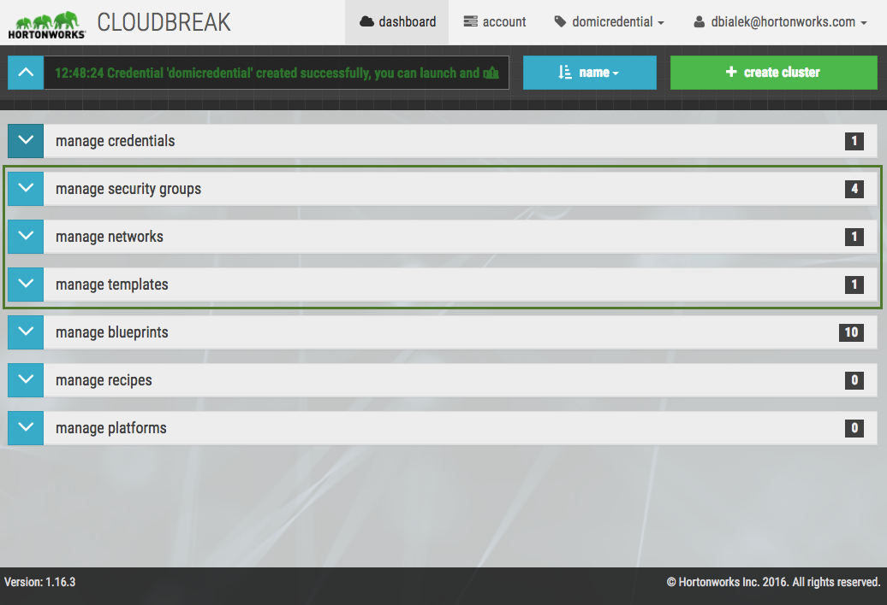

After you've logged in to Cloudbreak and created a Cloudbreak credential, you have two options:

* Create clusters using default infrastructure templates      
* Define your own infrastructure templates   

The **infrastructure templates** for resources such as **networks**, **security groups**, and **VMs and storage** are saved to Cloudbreak's database and can be reused with multiple clusters to describe the infrastructure. When you add these resources in Cloudbreak web UI, Cloudbreak does not make any requests to your cloud provider account. Resources are only created on your cloud provider account after the create cluster button has been pushed. 

This is illustrated and further explained in the [Architecture](architecture.md#cloudbreak-application-architecture) documentation.

We recommend that you review the default infrastructure  templates for networks, security groups, and VMs and storage to check if they meet your requirements. You can do this by expanding  their corresponding panes in the Cloudbreak web UI (shown in the screenshot) or by reading the documentation below.  

 

The following table describes the basic configurations that require an infrastructure template. If the default infrastructure templates don't work for you, you must create custom templates.
 

