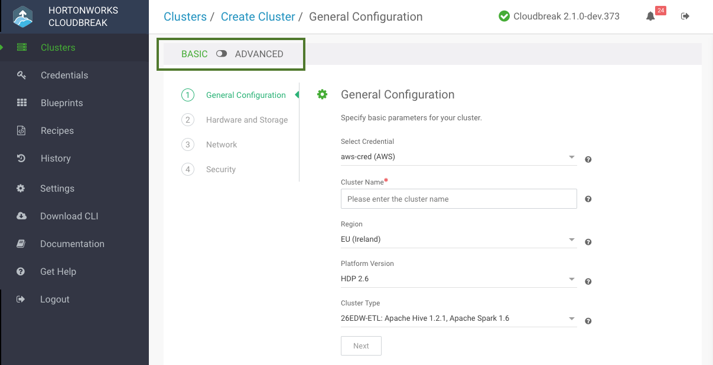

Use these steps to create a cluster.

**Prerequisites**

If you would like to use **Oozie** with **Ambari 2.6.1 or newer**, you must install the Ext JS library. For instructions, refer to [Recipe to Install Ext JS for Oozie](recipes.md#recipe-to-install-ext-js-for-oozie).

**Steps**

1. Log in to the Cloudbreak UI.

2. Click **Create Cluster** and the *Create Cluster* wizard is displayed.  
    By default, **Basic** view is displayed. To view advanced options, click **Advanced**. To learn about advanced options, refer to [Advanced Options](#advanced-options).

     

3. On the **General Configuration** page, specify the following general parameters for your cluster:

    | Parameter | Description |
|---|---|
| Select Credential | Choose a previously created credential. |
| Cluster Name | Enter a name for your cluster. The name must be between 5 and 40 characters, must start with a letter, and must only include lowercase letters, numbers, and hyphens. |