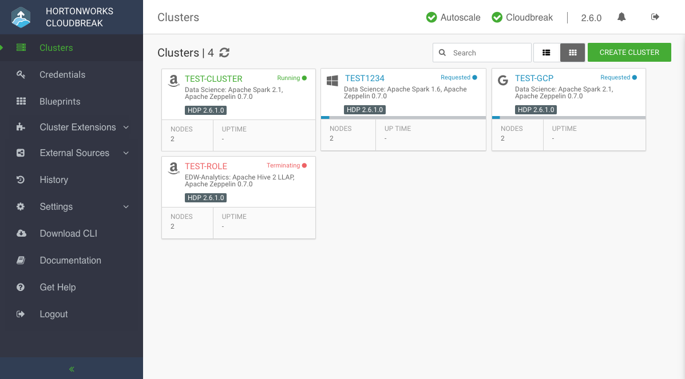

## Introduction

Welcome to the **Cloudbreak 2.7.0** documentation! 

Cloudbreak simplifies the provisioning, management, and monitoring of on-demand HDP and HDF clusters in virtual and cloud environments. It leverages cloud infrastructure to create host instances, and uses Apache Ambari via Ambari blueprints to provision and manage Hortonworks clusters. 

Cloudbreak allows you to create clusters using the Cloudbreak web UI, Cloudbreak CLI, and Cloudbreak REST API. Clusters can be launched on public cloud infrastructure platforms **Microsoft Azure**, **Amazon Web Services (AWS)**, and **Google Cloud Platform (GCP)**, and on the private cloud infrastructure platform **OpenStack**.

   

### Primary use cases

Cloudbreak allows you to create, manage, and monitor your HDP and HDF clusters on your chosen cloud platform:

* Dynamically deploy, configure, and manage clusters on public and private clouds (AWS, Azure, Google Cloud, OpenStack).   
* Use automated scaling to seamlessly manage elasticity requirements as cluster workloads change.    
* Secure your cluster by enabling Kerberos.  

### Architecture 

Refer to [Architecture](architecture.md).

### Core concepts   

Refer to [Core concepts](concepts.md). 

### Deployment options

In general, Cloudbreak offers two deployment options: a quickstart option and a production deployment option. Refer to [Deployment options](deployment-options.md).  
 

### Default cluster configurations

Cloudbreak includes default cluster configurations (in the form of blueprints) and supports using your own custom cluster configurations (in the form of custom blueprints).

The following default cluster configurations are available:

Platform version: **HDP 2.6**

| Cluster type  | Main services | Description |  List of all services included |
|---|---|---|---|
| Data Science | <i class="fa fa-check" style="color: green"></i> Spark 2, Zeppelin | Useful for data science with Spark 2 and Zeppelin. | HDFS, YARN, MapReduce2, Tez, Hive, Pig, Sqoop, ZooKeeper, Ambari Metrics, Spark 2, Zeppelin |
| EDW - Analytics | <i class="fa fa-check" style="color: green"></i> Hive 2 LLAP, Zeppelin | Useful for EDW analytics using Hive LLAP. | HDFS, YARN, MapReduce2, Tez, Hive 2 LLAP, Druid, Pig, ZooKeeper, Ambari Metrics, Spark 2 | 
| EDW - ETL | <i class="fa fa-check" style="color: green"></i> Hive,  Spark 2 | Useful for ETL data processing with Hive and Spark 2. | HDFS, YARN, MapReduce2, Tez, Hive, Pig, ZooKeeper, Ambari Metrics, Spark 2 |

Platform version: **HDF 3.1**

| Cluster type  | Main services | Description |  List of all services included |
|---|---|---|---|
| Flow Management | <i class="fa fa-check" style="color: green"></i> NiFi | Useful for flow management with NiFi. | NiFi, NiFi Registry, ZooKeeper, Ambari Metrics |
| Messaging Management | <i class="fa fa-check" style="color: green"></i> Kafka |  Useful for messaging management with Kafka. | Kafka, ZooKeeper, Ambari Metrics |

### Get started

To quickly get started with Cloudbreak, use the quickstart deployment option, which allows you to launch Cloudbreak from a template:

* [Get started on AWS](aws-quick.md)  
* [Get started on Azure](azure-quick.md) 
* [Get started on GCP](gcp-quick.md)  

> This option is not available for **OpenStack**; you must launch Cloudbreak manually, as described in [Launch on OpenStack](os-launch.md).    

In general, the steps include meeting the prerequisites, launching Cloudbreak from a template, and creating the Cloudbreak credential. After performing these steps, you can create a cluster based on one of the default blueprints.

    
Note

    
The Cloudbreak software runs in your cloud environment. You are responsible for cloud infrastructure related charges while running Cloudbreak and the clusters being managed by Cloudbreak.

