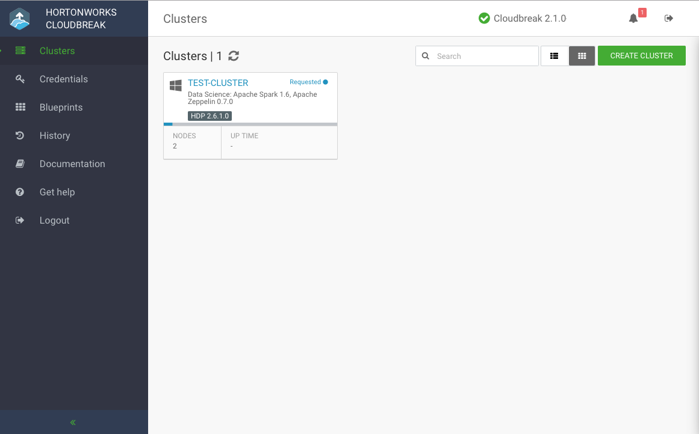

## Introduction

Welcome to the **Cloudbreak** documentation!

Cloudbreak simplifies the provisioning, management, and monitoring of on-demand HDP clusters in virtual and cloud environments. It leverages cloud infrastructure to create host instances, and uses Apache Ambari via Ambari blueprints to provision and manage HDP clusters. 

Cloudbreak allows you to create clusters using the Cloudbreak web UI, Cloudbreak Shell, and Cloudbreak REST API. Clusters can be launched on public cloud infrastructure platforms including **Microsoft Azure**, **Amazon Web Services (AWS)**, and **Google Cloud Platform (GCP)**, and on the private cloud infrastructure platform **OpenStack**.

    

### Use Cases

Cloudbreak allows you to create, manage, and monitor your clusters on your chosen cloud platform:

* Create a cluster based on your chosen blueprint and specify cluster properties based on the requirements of your workloads. 
* Create ephemeral clusters to run specific workloads.
* Manage and monitor your clusters using Cloudbreak UI: upscale, downscale, and when they are no longer needed, terminate them.
* Enable Kerberos and HA for your clusters. 
* Automate cluster creation using the Cloudbreak shell.  
* Develop your application using Cloudbreak API. 

### Architecture

Refer to [Architecture](architecture.md).

## Get Started

To get started with Cloudbreak:

1. Select the [cloud platform](#select-cloud-platforms) on which you would like to launch Cloudbreak.   
1. Select the [deployment option](#select-deployment-options) that you would like to use. 
1. [Launch Cloudbreak](#launch-cloudbreak). 

### Select Cloud Platform 

You can deploy and use Cloudbreak on the following cloud platforms:

* Amazon Web Services (AWS)
* Microsoft Azure
* Google Cloud Platform (GCP)
* OpenStack

### Select Deployment Option

There are two basic deployment options:

| Deployment Option | When to use |
|---|---|
| Instantiate one of the pre-built cloud images | 
This is the recommended basic deployment option.

 The cloud images include Cloudbreak Deployer pre-installed on a CentOS VM.
  |
| Install the Cloudbreak Deployer on your own VM | 
This is an advanced deployment option.
 
Select this option if you have custom VM requirements. The supported operating systems are RHEL, CentOS, and Oracle Linux 7 (64-bit).
 |

### Launch Cloudbreak 

Based on the choices made, launch Cloudbreak from one of the pre-built images:  

* [Launch on AWS](aws-launch.md)  
* [Launch on Azure](azure-launch.md)  
* [Launch on GCP](gcp-launch.md)   
* [Launch on OpenStack](os-launch.md)   
     
Or launch Cloudbreak [on your own VM](vm-launch.md) on one of these cloud platforms. 

In general, the steps include:

1. Meet the prerequisites  
1. Launch Cloudbreak   
1. Create Cloudbreak credential 

After performing these steps, you can create a cluster based on one of the default blueprints or upload your own blueprint and then create a cluster. 

    
Note

    
The Cloudbreak software runs in your cloud environment. You are responsible for cloud infrastructure related charges while running Cloudbreak and the clusters being managed by Cloudbreak.

